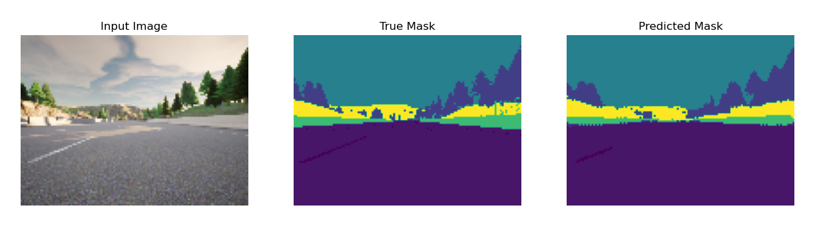
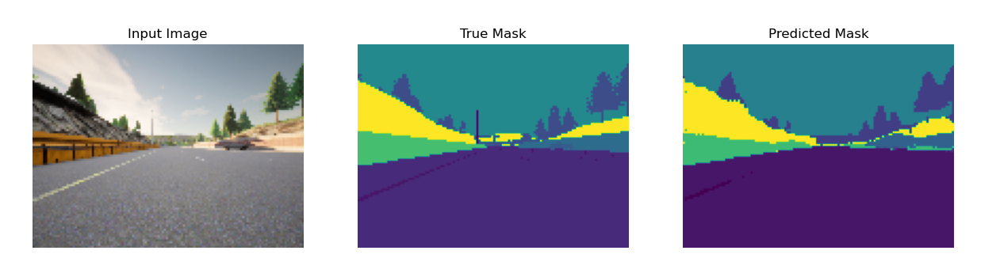

<h1 align="center">Semantic Segmentation of Urban Scenes in Cityscapes using Attention U-Net</h1>

Urban scenes are complex environments with diverse objects and structures, from buildings and vehicles to pedestrians and trees. Understanding the composition of these scenes is crucial for applications like autonomous driving, robotics, and urban planning.

Semantic segmentation is a key computer vision task that assigns a label to each pixel, facilitating the interpretation and analysis of urban environments.

<h2>Importance of Urban Scene Segmentation</h2>

<ul>
  <li><strong>Autonomous Driving</strong>: Self-driving cars rely on semantic segmentation to understand the road, identify obstacles, and navigate safely.</li>
  <li><strong>Robotics</strong>: Robots need a detailed understanding of surroundings to perform tasks such as navigation, object manipulation, and human-robot interaction.</li>
  <li><strong>Urban Planning</strong>: City planners can leverage segmentation to analyze the distribution of buildings, green spaces, and traffic patterns, leading to more informed urban design and resource allocation.</li>
</ul>

<h2>Cityscapes Dataset</h2>

This project utilizes a portion of the Cityscapes dataset, a widely recognized benchmark for urban scene understanding. Cityscapes provides a diverse collection of high-resolution images captured from street views, annotated with detailed pixel-level labels for various objects, including roads, buildings, vehicles, pedestrians, and more.

<h2>Attention U-Net: Enhanced Segmentation with Attention Mechanisms</h2>

The model used in this project is based on the <strong>Attention U-Net</strong> architecture, which builds on the classic U-Net structure with additional attention mechanisms. This enhancement allows the model to focus on more relevant regions within the image, refining feature extraction for complex urban scenes.

<h3>Key Components</h3>

<ul>
  <li><strong>Encoder-Decoder Structure</strong>: Like U-Net, Attention U-Net uses an encoder to downsample the input image and capture key features. The decoder then upsamples these features to produce a detailed segmentation map.</li>
  <li><strong>Skip Connections</strong>: The model incorporates skip connections that combine low-level spatial details from the encoder with high-level features from the decoder, aiding in precise boundary detection.</li>
  <li><strong>Attention Gates</strong>: Attention U-Net includes attention gates, which highlight essential features and suppress irrelevant ones. This mechanism allows the network to focus more selectively on regions of interest, improving segmentation performance, especially in complex urban scenes.</li>
</ul>

The Attention U-Net's combination of skip connections and attention mechanisms makes it highly effective for large and complex datasets like Cityscapes.

<h2>Results</h2>

The following examples illustrate the performance of the Attention U-Net on the Cityscapes dataset:

  
  
  

  
  
  

  
  
  

Each row contains:

<ul>
  <li><strong>Left</strong>: Original image from the Cityscapes dataset.</li>
  <li><strong>Center</strong>: Ground truth segmentation mask.</li>
  <li><strong>Right</strong>: Prediction generated by the Attention U-Net model.</li>
</ul>
